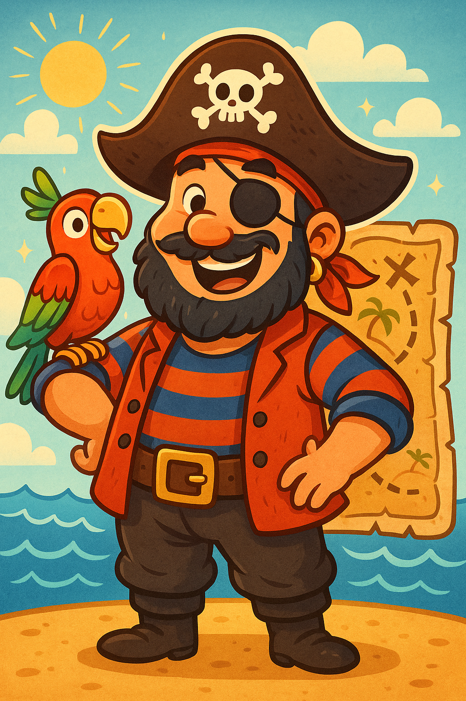

### История первая: Пират и звенящие колокольчики

В синем-синем море, где волны играли с солнечными лучами, плавала маленькая, но очень крепкая грузовая шлюпка по имени «Крепыш». А управлял «Крепышом» мальчик Петя. Петя был настоящим морским почтальоном, но возил он не просто вещи, а саму Радость, ту, что дана для всех. Он доставлял с большого материка на маленький Солнечный Остров чудесные грузы: сладкие арбузы, пушистые персики и, самое главное, коробки с маленькими звонкими колокольчиками для местной музыкальной школы. Дети на острове всегда с нетерпением ждали Петю.

Но в этом же море плавал и огромный, чёрный пиратский корабль с рваными парусами. Капитаном на нём был Одноглазый Билл — хмурый пират с густой бородой, в которой, казалось, запутался ветер. Билл же не верил ни в труд, ни в дружбу. В его сердце жило одно убеждение: всё самое лучшее в мире должно принадлежать лишь ему, чтобы заполнить зияющую в душе пустоту.

Однажды утром Одноглазый Билл заметил в свою подзорную трубу маленькую шлюпку Пети.
— Ага! — прорычал он. — Наверняка этот мальчишка везёт золото и драгоценности! На абордаж!

Пиратский корабль быстро догнал «Крепыша». Билл, как большая грозовая туча, перепрыгнул на палубу Петиной шлюпки.
— Отдавай сокровища, юнга! — приказал он.
— У меня нет сокровищ, — спокойно ответил Петя, хотя сердце у него колотилось, как маленький барабан. — Я везу фрукты и колокольчики для детей с Солнечного Острова.
— Колокольчики? — хмыкнул пират. — Наверное, волшебные! Забираю всё!

Пираты перегрузили на свой корабль и арбузы, и персики, и все коробки с колокольчиками. Одноглазый Билл был очень доволен. Он открыл одну коробку, достал блестящий колокольчик и потряс его. «Дзинь-дзинь!» — весело ответил колокольчик.
— Вот так сокровище! — обрадовался пират. Он высыпал все-все колокольчики из коробок себе в карманы, в шляпу, за пояс — повсюду!

И вот тут началось самое интересное.

Пиратский корабль поплыл дальше, а колокольчики звенели. Они звенели при каждом шаге Билла. «Дзинь-дзинь-дзинь!» Когда он садился — «Дзинь!». Когда вставал — «Дзинь-дзилинь!». Когда пытался отдать команду, его грозный рык «Налево руля!» превращался в «Налево... дзинь-дзинь... руля-дзили-линь!».

Сначала это было забавно, но вскоре пирата звон начал ужасно раздражать. Гармония, созданная для того, чтобы ею делиться, стала для него невыносимым шумом. Ночью он не мог уснуть, потому что каждый раз, когда он ворочался, со всех сторон раздавалось: «ДЗИНЬ!». Его команда начала над ним посмеиваться. Никто больше не боялся грозного капитана, который постоянно звенел, как новогодняя ёлка. Он не мог подкрасться к другому кораблю, чтобы его ограбить — его было слышно за милю!

Через два дня Одноглазый Билл не выдержал. Злой, невыспавшийся и совершенно измученный, он развернул свой корабль и помчался догонять Петю.

— Забирай свои проклятые колокольчики! — закричал он, найдя шлюпку Пети. — И фрукты свои забери, от них только живот болит, когда ешь от жадности! От этого звона у меня голова раскалывается!

Он сгрузил всё обратно на шлюпку «Крепыш», а сам, зажав уши руками, поскорее уплыл прочь, ворча себе под нос, что лучше бы он честно ловил рыбу.

А Петя улыбнулся и доставил весь груз на Солнечный Остров. Дети были так рады и фруктам, и особенно колокольчикам, из которых получилась чудесная, весёлая музыка.

> Зло становится наказанием само для себя. Одноглазый Билл решил, будто сокровище — это вещь, которой можно владеть. Но он не понял, что подлинное сокровище не в самих колокольчиках, а в музыке, что рождается из их согласия. Сокровище Пети было еще больше — это радость, которой он служил. И такая радость, в отличие от пиратской добычи, не звенит в ушах до головной боли, потому что её источник — в самом сердце мира, сотворённого Богом для любви, а не для грабежа.

---

### История вторая: Пират и липкие перья

Солнце снова золотило верхушки волн, и Петя на своей шлюпке «Крепыш» опять вёз на Солнечный Остров драгоценный груз. На этот раз в трюме покоились большие банки с густым клубничным вареньем для праздничных пирогов и огромный мешок с разноцветными перьями для карнавальных костюмов. На острове готовились к великому Празднику Радости.

Но Одноглазый Билл и его команда не дремали. После истории с колокольчиками они затаились в своей мрачной бухте, однако долго сидеть без дела не смогли. Их сердца, в которых не было места для Бога, снова позвала в море ненасытная жадность.
— В прошлый раз нам не повезло! — рычал Билл, завидев «Крепыша». — Но сегодня мы отберём у этого мальчишки нечто по-настоящему ценное! Полный вперёд!

Чёрный корабль, словно тень, настиг маленькую шлюпку.
— А, снова ты! — усмехнулся Билл, перепрыгивая на палубу. — Что везёшь на сей раз? Говори, или я заставлю твоего «Крепыша» чихать!
Петя, который уже знал, что со злом лучше не спорить, когда оно сильнее, лишь вздохнул и указал на груз.
— Варенье и… перья.
— Перья?! — изумился пират. Он потрогал мешок. — Мягкий! Должно быть, это какая-то драгоценная ткань! А варенье мы и так съедим. Грузите всё на борт!

Пираты, как всегда, работали грубо и небрежно. Они уронили одну банку, и липкое, благоухающее варенье растеклось по палубе. Но им было всё равно. Забрав чужое, они подняли свой рваный парус и уплыли, оставив Петю посреди моря.

Но Петя на этот раз не огорчился. Он мудро улыбнулся, развернул свою шлюпку и поплыл не на Солнечный Остров, а в другую сторону — к большому портовому городу, где стоял катер Морской Полиции.

А что же творилось на пиратском корабле?
Обрадованные добычей, пираты уселись пировать. Они вскрыли банки с вареньем и стали есть его прямо руками, вымазав липкими пальцами всё вокруг: свои бороды, усы, камзолы и даже штурвал корабля.
— А теперь поглядим, что в мешке! — скомандовал Одноглазый Билл.
Самый сильный пират по имени Хромой Джо взмахнул саблей и распорол мешок.

И тут… случился «ПУХ!».
Из мешка вырвалось огромное облако из тысяч лёгких, ярких, разноцветных пёрышек! Они закружились в воздухе и медленно, точно волшебный снег, стали опускаться на корабль.

Но они не просто опустились. Они прилипли! Они прилипли ко всему, что было измазано вареньем. Грозный Одноглазый Билл вдруг стал похож на гигантского пёстрого попугая с розовыми, жёлтыми и синими перьями в бороде. Штурвал превратился в пушистый помпон. Чёрные пиратские флаги стали весёлыми и радужными. Весь корабль и вся его команда выглядели так, будто их уронили в подушку после того, как искупали в сиропе.

Пираты чихали, отряхивались, пытались отодрать от себя перья, но те прилипли намертво. Теперь они были не грозой морей, а самым нелепым плавучим карнавалом на свете.

И именно в этот миг на горизонте показался быстрый белый катер. Это была Морская Полиция.
— Эй, на корабле! — крикнул капитан полиции в громкоговоритель. — Нам поступило сообщение об ограблении грузовой шлюпки. Вы не видели подозрительный пиратский корабль?
Одноглазый Билл хотел грозно ответить, но когда он открыл рот, оттуда вылетело прилипшее к усам пёрышко.
— Апчхи! Нет, не видели! — пискнул он.
Но было уже поздно. Полицейские смотрели на пиратский корабль, который выглядел как плавучий курятник, и не могли сдержать смех.
— Кажется, мы вас нашли, — улыбнулся капитан полиции. — Руки вверх! И постарайтесь не разбрасывать перья.

Так пиратов и взяли под стражу. Они были такие липкие и смешные, что даже не смогли оказать сопротивления. Их корабль отбуксировали в порт, а самих пиратов отправили в специальную тюрьму для плохих мореходов, где первым делом заставили долго-долго отмываться.

Петя получил свой груз обратно и успел как раз к началу Праздника Радости. Карнавальные костюмы получились великолепными, а пироги с клубничным вареньем — дивными на вкус.

> Нельзя построить своё счастье на чужой беде. Жадность и зло не только ведут к наказанию, но и неизбежно выставляют тебя на посмешище. Ведь тот, кто творит дурные дела, оставляет за собой липкий и очень заметный след, который рано или поздно приведёт его туда, где ему совсем не захочется быть. Лучше быть скромным служителем радости, чем самым глупым и пёстрым пиратом на свете.

---

### История третья: Искупление Одноглазого Билла

Прошло время. Одноглазый Билл отсидел свой срок в портовой тюрьме, где ему пришлось много думать и отмывать палубы. И знаешь, что он понял? Что быть пиратом — это не только глупо, но и ужасно пусто. Никто не радовался его появлению, а награбленное оставляло на душе лишь холод и одиночество.

Поэтому, когда Билл вышел на свободу, он продал свою старую саблю и треуголку, а на вырученные деньги купил маленькую, но крепкую рыбацкую лодку. Он назвал её «Тихая Гавань». Его густая борода теперь была аккуратно подстрижена, а единственный глаз смотрел на мир не с жадностью, а со смиренной надеждой. Он решил стать честным рыболовом.

Поначалу у него получалось неважно. Он был неуклюж, как медведь в шлюпке, и по старой привычке кричал «На абордаж!», когда на крючок попадалась крупная рыба. Но он очень старался. Иногда мимо на своей лодке «Крепыш» проплывал Петя. Он не смеялся над Биллом, а наоборот, по-доброму махал ему рукой и подсказывал, где лучше клюёт. Постепенно Билл научился распутывать сети, читать погоду по облакам и даже начал улыбаться, когда чайки садились на борт его лодки в ожидании угощения.

Однажды утром Билл поймал самый большой улов в своей жизни: целую лодку серебристой, блестящей скумбрии! Он был так горд и счастлив. «Вот оно, настоящее дело, — думал он. — Не отнятое, а добытое. Своими руками. Теперь я продам рыбу и куплю себе новый тёплый свитер».

Но вдруг горизонт потемнел. К «Тихой Гавани» на всех парусах нёсся новый пиратский корабль, ещё чернее и страшнее, чем был у Билла. На флаге у него был нарисован не весёлый Роджер, а злобный осьминог. Капитаном там был жуткий пират по имени Капитан Слизень, весь увешанный ракушками и тиной.

— Эй, старикан! — проскрипел Слизень, и его команда, похожая на мокрых ворон, окружила лодку Билла. — Хороший улов! Теперь он наш!
— Нет! — закричал Билл, закрывая рыбу собой. — Я поймал её честным трудом!
— Честный труд? — захохотал Капитан Слизень. — Это для слабаков! Сильные просто берут то, что хотят!

Пираты оттолкнули Билла, и он упал на дно своей лодки. Они быстро перегрузили всю его рыбу к себе на корабль, смеясь и толкаясь.

И вот в этот самый миг, лёжа в своей пустой лодке и глядя, как пираты увозят плоды его долгого труда, Билл впервые по-настоящему понял. Он не просто знал, что грабить — это дурно. Он это _почувствовал_ в самой глубине своего существа. Он ощутил ту обиду, несправедливость и бессилие, которые когда-то сам причинял другим. На его единственный глаз навернулась слеза — не от досады, а от горького прозрения. «Так вот каково это…» — прошептал он.

Но история на этом не закончилась.

Пираты Капитана Слизня были не только злыми, но и очень глупыми. Они не знали, что эта блестящая скумбрия была особенной. В этот день в море вошёл косяк очень, ОЧЕНЬ жирной рыбы. Настолько жирной, что от неё становились скользкими руки, палуба, одежда — всё, к чему она прикасалась.

Обрадованные пираты решили тут же устроить пир. Они бросили рыбу на огромную сковородку. Жир начал таять и шипеть, и палуба их корабля за несколько минут покрылась тонким, невидимым слоем скользкого масла.

И тут началось! Капитан Слизень хотел пойти к штурвалу, но его ноги поехали, и он, как на коньках, проехался через всю палубу и врезался в мачту — БУМ! Один пират побежал за верёвкой, поскользнулся и устроил кучу-малу из трёх своих товарищей. Они падали, скользили, сшибали друг друга с ног, как кегли в боулинге. Их грозный корабль превратился в настоящий каток! Они не могли ни управлять им, ни даже просто стоять на ногах. Корабль закружился на месте, а пираты беспомощно катались по палубе, вопя от ярости и удивления.

Их было так хорошо видно и слышно, что проплывавшая мимо Морская Полиция, которую как раз позвал заметивший неладное Петя, без труда их догнала. Полицейским даже не пришлось ни с кем сражаться. Они просто подождали, пока все пираты, поскользнувшись, не съехались в одну большую кучу в центре палубы, и спокойно их арестовали.

Рыбу, конечно же, вернули Биллу. Он продал её на рынке, купил себе самый тёплый и красивый свитер и ещё маленькую баночку клубничного варенья, которую отнёс Пете в знак благодарности.

С тех пор Билл стал самым счастливым рыболовом во всём море. Он понял одну простую вещь, которую, быть может, сам **Бог** вкладывает в каждую рыбу и в каждое честное сердце.

> Мало лишь знать, что есть добро и зло, как различают цвета на картинке. По-настоящему ты начинаешь это видеть лишь тогда, когда чужая боль отзывается в тебе как твоя собственная. А радость простого труда, пусть даже самого малого, куда долговечнее и полнее любой украденной добычи. Ведь подлинное сокровище — это покой в душе, и его у тебя никто отнять не сможет.

---

### История четвёртая: Финальная глава — Офицер Билл и негасимый свет

Прошли годы. Море всё так же играло волнами, а солнце всё так же рассыпало по ним свои золотые монеты. Петя вырос. Он уже был не мальчиком, а молодым капитаном, и его шлюпка «Крепыш» сменилась на изящную, быструю шхуну «Верный Друг». Но он по-прежнему служил тому, что считал самым лучшим делом на свете, — доставлял на Солнечный Остров радость: теперь это были не только фрукты, но и книги для библиотеки, краски для художников и даже саженцы диковинных цветов.

А Одноглазый Билл… О, его история была самой удивительной. После того случая со скользкой рыбой, капитан Морской Полиции разглядел в бывшем пирате нечто большее, чем просто поймавшего удачу рыболова. Он увидел в нём человека, который отвернулся от тени к свету, человека, знающего все пиратские хитрости, все тайные бухты и все уловки, на которые способны морские разбойники.
— Билл, — сказал ему однажды капитан, — ты знаешь море и его тёмные стороны лучше, чем кто-либо из нас. Не хочешь ли ты помогать нам защищать тех, кто честен?

Билл долго думал. Сможет ли он, бывший пират, носить форму защитника закона? Но потом он вспомнил не только обиду в своих собственных глазах, когда у него украли улов, но и ту пустоту в сердце, что толкала его когда-то на разбой. И он понял, что его тёмное прошлое может послужить светлому делу. Так Одноглазый Билл стал Офицером Биллом — самым необычным, но и самым эффективным сотрудником Морской Полиции. Он не носил блестящих пуговиц, предпочитая свой старый тёплый свитер, но его единственный глаз видел любую несправедливость за милю. И все в порту его очень уважали. В море наступили спокойные времена.

Но зло, увы, коварно и живуче, словно сорняк. Даже если его вырвать, где-то во тьме может остаться корешок, который однажды снова даст горький росток.

В тюрьме на Скалистом острове сидел Капитан Слизень. Он не изменился. Он не размышлял об ошибках, а лишь копил злобу и мечтал о мести. И однажды, в самую тёмную и штормовую ночь, ему удалось сбежать. Он собрал новую команду из таких же отчаянных и алчных негодяев и снова поднял свой чёрный флаг со злым осьминогом.

Весть о побеге Слизня докатилась до порта. Все были встревожены. А скоро стало известно и о его цели. Приближался главный праздник года — Фестиваль Огней, и Петя вёз на своей шхуне самый ценный груз за всю свою жизнь: Великую Морскую Звезду. Это была не драгоценность, а настоящее чудо — огромный, выточенный из цельного горного хрусталя кристалл, который должен был стать сердцем праздничного фейерверка. Говорили, что когда праздничный свет пройдёт сквозь него, всё небо над островом расцветёт тысячей радуг.

— Он погонится за Петей, — тут же сказал Офицер Билл на совещании в полиции. — Слизень не просто хочет грабить. Он хочет отомстить и украсть у всех радость. Он ударит по самому дорогому.
— Мы отправим эскорт! — решил капитан.
— Бесполезно, — покачал головой Билл. — Слизень хитёр. Он не нападёт в открытую. Он использует туман, рифы, обманные манёвры. Чтобы поймать такого, нужно думать, как он. У меня есть план.

Билл нашёл Петю в порту, когда тот уже готовился к отплытию.
— Петя, друг мой, мне нужна твоя помощь. И твоё мужество.
Он рассказал ему свой хитроумный план, и Петя, который безгранично доверял бывшему пирату, без колебаний согласился.

Как и предсказывал Билл, корабль Слизня напал на шхуну Пети посреди моря, вынырнув из густого, как молоко, тумана. Пираты были похожи на голодных акул.
— Отдавай звезду, мальчишка! — прошипел Слизень, перепрыгивая на палубу «Верного Друга». — Сегодня я заберу и твой груз, и твою улыбку!
Петя, как они и договаривались с Биллом, сделал испуганное лицо и указал на самый большой, обитый железом ящик в центре палубы.
— Она… она там! Только она очень тяжёлая!
— Тем лучше! — захохотал Слизень. — Значит, дорогая!

Его пираты накинулись на ящик. Они обвязали его толстыми канатами, напряглись и с кряхтением потащили на свой корабль. Они были так увлечены, что не заметили, как Петя незаметно отрезал маленький шнурок у основания ящика.

Пираты с грохотом водрузили ящик на свою палубу.
— Победа! — закричал Слизень. — Теперь посмотрим на сокровище!
Он взмахнул топором, чтобы разбить крышку, но… тут произошло нечто странное.

Из-под ящика вдруг поползли сотни маленьких, крепких верёвочек. Это были специальные морские узлы, которые Билл и Петя хитроумно сплели и спрятали внутри. Как только Петя обрезал удерживающий шнур, механизм сработал. Узлы, как живые змеи, расползлись по палубе и мгновенно затянулись на всём, чего касались: на мачтах, на бочках, на оружии пиратов и, самое главное, на их ногах! Это была гигантская «сеть-ловушка», которую придумал Билл, вспомнив, как он сам когда-то мучился в сетях греха.

Пираты оказались опутаны с ног до головы. Они дёргались, но узлы затягивались только туже. Капитан Слизень, запутавшийся в трёх канатах, напоминал неуклюжего паука в собственной паутине. Их грозный корабль был полностью обездвижен.

В этот момент из тумана выплыл полицейский катер, а за его штурвалом стоял Офицер Билл. Он посмотрел на беспомощного Слизня.
— Ты гонялся за блеском, Слизень, но лишь собственная тьма поймала тебя в свои сети, — спокойно сказал Билл. — Ты думал, что крадёшь сокровище, но на самом деле ты сам залез в ловушку.

Великую Морскую Звезду, которая всё это время надёжно хранилась в маленьком неприметном бочонке, доставили на остров в целости и сохранности. Праздничный фейерверк был самым красивым за всю историю Острова. А Билл и Петя стояли на берегу, смотрели на радужное небо и улыбались.

> И в этом главный урок этой истории. Иные сердца, познав свою неправоту, способны обратиться к свету и найти в себе силы для новой жизни, как Одноглазый Билл, в котором раскаяние оказалось сильнее былой гордыни. Но есть и те, чьи души настолько поглощены тьмой, что любой луч лишь ожесточает их, как у Капитана Слизня. И поэтому миру всегда будут нужны такие смелые и добрые люди, как Петя, и такие мудрые защитники, как Билл; ибо настоящее сокровище, завещанное нам Самим **Богом**, — это не хрусталь и не золото, а мир в душе и свет, которым мы делимся друг с другом.
